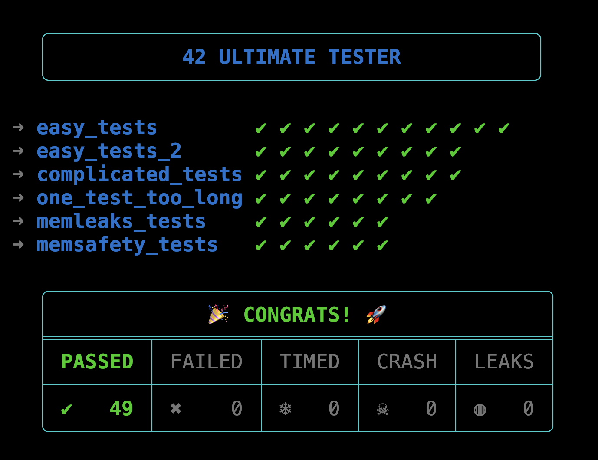
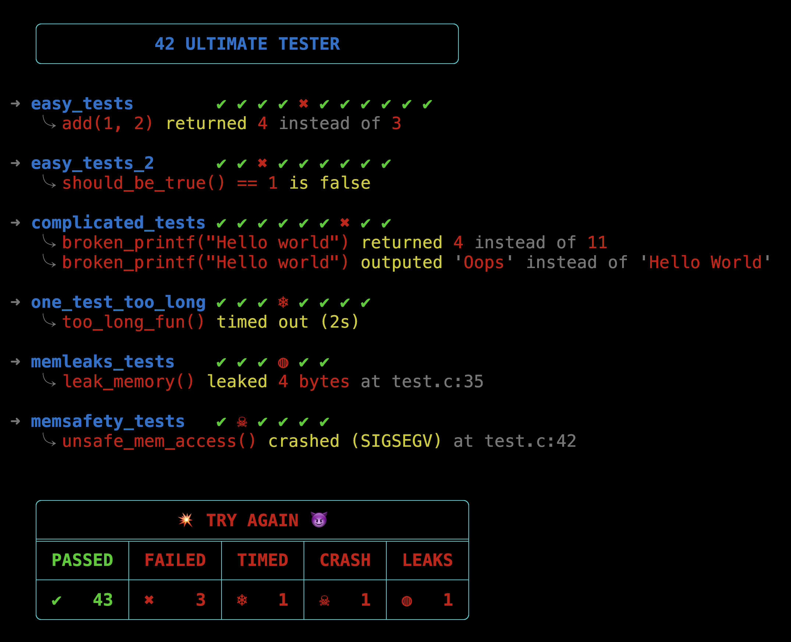

# 42 ULTIMATE TESTER

[](#)
[](#)
[](#)
[](#)

42 Ultimate Tester is a **lightweight, standalone C unit testing library**.  

No complex frameworks, no dependencies — just you, your code, and the cold hard truth.

## 🙌 Highlights

- Pure **POSIX** `sh` / `c` framework with **no dependencies**
- **Automatic test detection and run**
- **Automatic type detection** inside asserts
- **Automatic redirections** handling
- **Automatic human-readable logs**:
	- See the exact expression which failed
	- See both the "got" and "expected" values
	- See the file and line in which crash / leaks happened
	- Set up customized labels if you prefer

> ✌️ Just write what you want to test, the framework handles all the complicated stuff.

<div style="display: flex; gap: 10px;">
    
    
</div>

## Table of contents
- [Install](#️-install)
- [Update and uninstall](#️-update-and-uninstall)
- [Documentation](#-documentation)
- [Limitations](#️-limitations)

## ⚙️ Install

From anywhere, just run:
```bash
curl -fsSL https://raw.githubusercontent.com/guillaumeast/42_ultimate_tester/master/1_scripts/install.sh | sh
```
or:
```bash
wget -qO- https://raw.githubusercontent.com/guillaumeast/42_ultimate_tester/master/1_scripts/install.sh | sh
```

This will:
1. Clone the repo to `~/.42_ultimate_tester/`
2. Build the `libfut.a` static library
3. Link the library and header to your system (Global or Local)

You can now run your first test in just a few seconds by following this [guide](docs/0_get_started.md) ⚡️

> ✌️ No setup, no dependencies, no editing, no excuses.

## 🛠️ Update and uninstall

You can update by running the following command:
```bash
~/.42_ultimate_tester/1_scripts/update.sh
```

You can uninstall the framework by running the following command:
```bash
~/.42_ultimate_tester/1_scripts/uninstall.sh
```

To make your life easier, you can set up aliases in your shell config.  
For example, if you use `zsh` shell, run the following commands:

```bash
echo "alias fut_update='~/.42_ultimate_tester/1_scripts/update.sh'" >> ~/.zshrc
echo "alias fut_uninstall='~/.42_ultimate_tester/1_scripts/uninstall.sh'" >> ~/.zshrc
source ~/.zshrc
```

Now you can simply:
- Update with `fut_update`
- Uninstall with `fut_uninstall` (but you won't, right?)

## 📚 Documentation

### 🚀 [Get Started](docs/0_get_started.md)
Your first steps. Write a test, compile it, and run it in less than a minute.

### 🧩 [Test Sets](docs/1_sets.md)
Learn more about Test Sets and global timeouts.
- `Test()`: create isolated executable test blocks.

### 🔀 [Redirections](docs/2_redirections.md)
Master `stdout` and `stderr` redirections.  
- `redirect_start()`, `redirect_read()`, `redirect_stop()`: manually redirect outputs and read them back.  
- `get_output()`: Easily capture outputs in a single line.

### ✅ [Assertions](docs/3_assertions.md)
Understand how to verify correctness, compare behaviors and detect crashes/freezes with safe and flexible assertion tools.  
- `assert()`, `assert_eq()`, `assert_neq()`: verify your code logic with type-aware comparisons.  
- `compare()`: compare behaviors of two functions.  
- `*_label()`: use custom labels instead of default ones.

### 🧠 [Memchecks](docs/4_memchecks.md)
Catch memory leaks and unsafe memory accesses directly from your tests.
- `memleaks()`: detect unfreed allocations.
- `memsafety()`: detect null dereferences, unsafe malloc usage, and crash-prone memory operations.

## ⚠️ Limitations

- **Nested Timeouts**: Using `assert*()`/`compare*()`/`mem*()` timeouts inside a `Test()` which also have a timeout enabled **may introduce race conditions**. (WIP)
- **Struct Comparison**: `assert_eq*()` and `assert_neq*()` do not support struct comparison yet. (WIP)
- **Nested redirections**: Using `print_stdout()` or `print_stderr()` inside nested redirections is not supported yet. (WIP)
- **Logs length**: Test set titles and failed assertions logs are limited to 256 characters max. (WIP)

> Knowing the limitations is part of mastering the tool.
